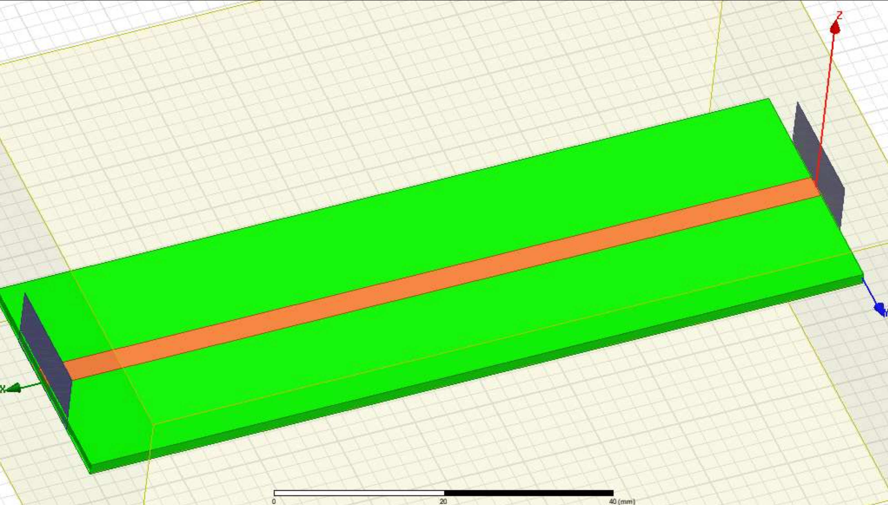
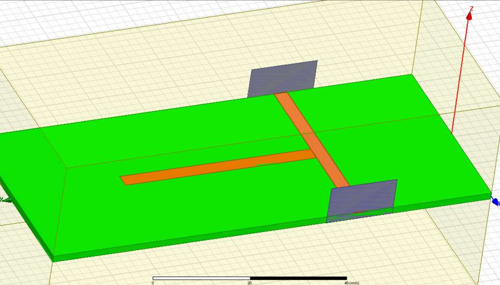

# HFSS Simulations

In this repository you'll find some simulations that I done for my master degree microwave networks classes. All projects were design in FR-4 substrate. 

## Waveguide

This folder is about a simple 50 Ohms waveguide

## Wilkinson divider

This one is a project of a -3 dB power splitter Wilkinson divider 

## Stub ressonator

This folder contains a microstrip stub ressonator with 950 MHz central frequency

## Filter

The last project is a Chebyshev band-pass filter, with central frequency at 950 MHz.

